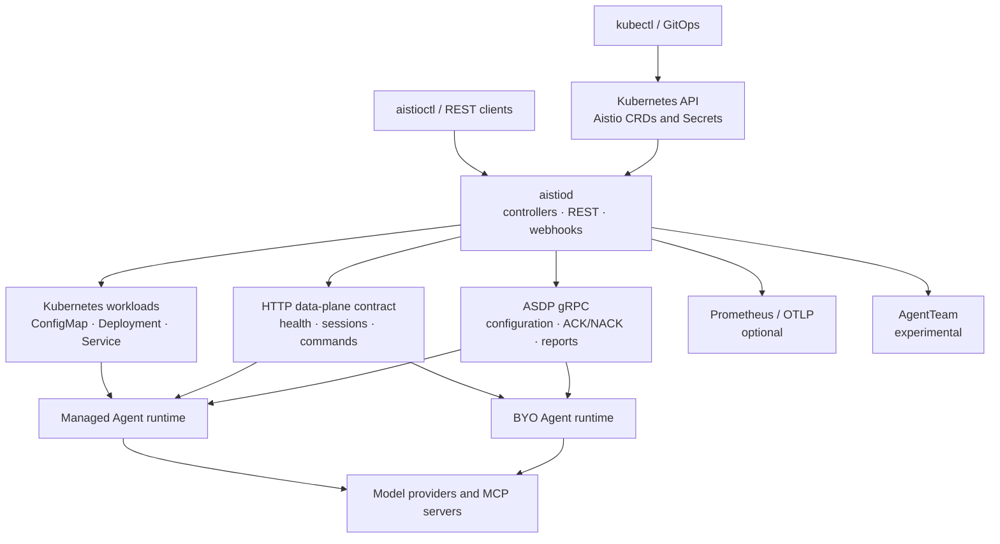

# Aistio

English | [简体中文](README_zh.md)

[](go.mod)
[](LICENSE)

**Istio is for microservices. Aistio is for AI agents.**

Aistio is a Kubernetes-native control plane and operator for AI agent workloads.
It uses `agentscope.io/v1alpha1` custom resources to describe agents, model
configuration, MCP servers, sessions, and experimental team collaboration.
`aistiod` reconciles that desired state into Kubernetes workloads and connects
compatible agent runtimes through an HTTP data-plane contract and the
bidirectional Agent Service Discovery Protocol (ASDP).

The current Helm chart is `v0.2.0`. The API remains `v1alpha1`, so fields and
behavior may change incompatibly.

> [!IMPORTANT]
> Aistio is a technical preview and should not be treated as a production-ready
> Agent Service Mesh. `AgentTeam`, `TeamTask`, and `TeamMessage` are experimental
> and disabled by default. `SandboxClaim` provisioning is not implemented.

## Project Boundaries

Aistio provides control-plane capabilities:

- Create or observe Kubernetes workloads from `Agent` resources.
- Record model and MCP server configuration.
- Probe data-plane health and synchronize session summaries.
- Push configuration and receive runtime reports through ASDP.
- Expose Kubernetes APIs, a REST API, admission webhooks, and `aistioctl`.

Aistio does not:

- Call large language models or act as an inference gateway.
- Execute an agent reasoning loop or tool calls.
- Provide transparent sidecar traffic interception.
- Replace the agent runtime; the data plane must implement the HTTP contract or
  ASDP explicitly.

## Capability Status

| Capability | Status | Current boundary |
| --- | --- | --- |
| Declarative Agent | Limited availability | Reconciles ConfigMap, Deployment, and Service resources; the only built-in adapter is `agentscope-java`. |
| BYO workload | Available | Discovers or adopts existing Deployments and synchronizes replica and health status without taking ownership of `workloadRef` Deployments. |
| Fixed replica management | Available | Updates Deployment replicas from the Agent specification; HPA-based autoscaling is not implemented. |
| HTTP data-plane contract | Available | Supports metadata, health, session observation, and explicit compression or termination commands. |
| `ModelConfig` | Partial | Validates Secret references and delivers configuration; Aistio does not proxy model requests. |
| Remote MCP | Partial | Supports Streamable HTTP POST and JSON or SSE responses; traditional SSE transport and Stdio tool discovery are not implemented. |
| ASDP | Technical preview | Implements bidirectional streams, configuration ACK/NACK, heartbeats, and session reports; deployment integration still has known gaps. |
| `AgentTeam` | Experimental | Implements task, message, and control-plane state machines; the complete multi-agent execution loop is not finished. |
| Sandbox | Not implemented | The experimental controller accepts `SandboxClaim` resources but leaves them `Pending` without provisioning a sandbox. |

## Architecture



The Kubernetes API is the durable source of desired and observed state; Aistio
does not require a separate database. ASDP connections and configuration
snapshots are held in memory by each `aistiod` replica. Model requests and MCP
tool calls are made by the agent runtime, not proxied through the control plane.

## API Resources

| Resource | Purpose | Status |
| --- | --- | --- |
| `Agent` | Declare a managed Agent workload or describe a BYO workload. | Core |
| `AgentSession` | Track runtime session state, token counts, context pressure, and explicit session commands. | Core |
| `ModelConfig` | Validate provider-neutral model settings and references to credentials in Kubernetes Secrets. | Core |
| `MCPServer` | Register Remote or Stdio MCP configuration and discover tools from Remote servers. | Core; partial transport support |
| `AgentTeam` | Define lead/member team topology and lifecycle. | Experimental |
| `TeamTask` | Persist task ownership and progress for an Agent team. | Experimental |
| `TeamMessage` | Persist the team message outbox for delivery through connected data planes. | Experimental |
| `SandboxClaim` | Describe a requested Agent sandbox. | Experimental API; provisioning not implemented |

## Getting Started

### Prerequisites

- A reachable Kubernetes cluster
- Helm 3.x
- `kubectl`
- Git

Go 1.26.5 or newer is also required for local development.

### Install the Control Plane

Clone the repository and run the Helm-based installer:

```bash
git clone https://github.com/spring-ai-alibaba/aistio.git
cd aistio
./install/install.sh
```

The equivalent Helm command is:

```bash
helm upgrade --install aistio ./helm/aistio \
  --namespace aistio-system \
  --create-namespace
```

Verify the deployment, CRDs, and version endpoint:

```bash
kubectl -n aistio-system rollout status deployment/aistio-controller
kubectl get crds -o name | grep agentscope.io
kubectl -n aistio-system port-forward service/aistio-controller 8080:8080
curl http://127.0.0.1:8080/api/v1/version
```

### Create a Model Configuration

The sample `ModelConfig` expects a Secret named `dashscope-credentials` in the
`production` namespace:

```bash
export DASHSCOPE_API_KEY="your-key"
kubectl create namespace production
kubectl -n production create secret generic dashscope-credentials \
  --from-literal=api-key="${DASHSCOPE_API_KEY}"
kubectl apply -f config/samples/modelconfig.yaml
kubectl -n production get modelconfig qwen-max-config
```

The repository contains additional manifests for the main resource types:

| Example | Manifest |
| --- | --- |
| Remote MCP server | [`config/samples/mcpserver.yaml`](config/samples/mcpserver.yaml) |
| Declarative Agent | [`config/samples/agent_declarative.yaml`](config/samples/agent_declarative.yaml) |
| BYO workload | [`config/samples/agent_byo_workloadref.yaml`](config/samples/agent_byo_workloadref.yaml) |
| Agent team | [`config/samples/agentteam.yaml`](config/samples/agentteam.yaml) |

Review each manifest before applying it. The samples use the `production`
namespace, placeholder credentials, and environment-specific endpoints. The
Agent team sample also requires the experimental profile and referenced Agent
resources.

### Adopt an Existing Workload

Add the Aistio discovery label to an existing Deployment:

```bash
kubectl label deployment my-agent agentscope.io/managed=true
```

The control plane creates a corresponding BYO `Agent` resource. The data plane
must implement at least:

- `GET /agentscope/info`
- `GET /agentscope/health`

See the [data-plane HTTP contract](docs/zh/reference/data-plane-contract.md) for
the full contract.

### Uninstall

```bash
helm uninstall aistio --namespace aistio-system
```

Helm does not remove or upgrade CRDs automatically. Review the remaining
`agentscope.io` custom resources and CRDs separately before deleting them.

## Experimental Features

Enable the experimental profile with:

```bash
./install/install.sh -p experimental
```

This enables distributed `AgentTeam` coordination and exposes the ASDP gRPC
Service port. Team state is persisted through `AgentSession`, `TeamTask`, and
`TeamMessage` resources. The profile also enables the `SandboxClaim` controller,
but the controller currently reports provisioning as not implemented.

`aistiod` starts ASDP by default. In the current Helm chart, the gRPC Service
port is exposed only by the experimental profile, so connector bootstrap should
be treated as an explicit integration step.

## Documentation

The current documentation set is written in Chinese:

- [Documentation home](docs/zh/intro.md)
- [Installation](docs/zh/getting-started/installation.md)
- [Architecture](docs/zh/concepts/architecture.md)
- [Agent management](docs/zh/guides/agents.md)
- [BYO workloads](docs/zh/guides/byo.md)
- [Model and MCP configuration](docs/zh/guides/model-and-mcp.md)
- [Session management](docs/zh/guides/sessions.md)
- [ASDP reference](docs/zh/reference/asdp.md)
- [CLI reference](docs/zh/reference/cli.md)
- [REST API reference](docs/zh/reference/rest-api.md)
- [Deployment and operations](docs/zh/operations/deployment.md)
- [Experimental teams and sandbox](docs/zh/experimental/teams-and-sandbox.md)

## Development

Install code-generation tools before changing API types or generated manifests:

```bash
make install-tools
```

| Command | Purpose |
| --- | --- |
| `make build` | Build `bin/aistiod`. |
| `make test` | Run all Go tests and write `cover.out`. |
| `make test-integration` | Run controller integration tests with `envtest`. |
| `make fmt` | Format Go packages. |
| `make vet` | Run `go vet ./...`. |
| `make manifests` | Regenerate CRDs, RBAC, and webhook manifests. |
| `make verify` | Verify generated API and deployment artifacts are current. |
| `make helm-lint` | Lint the Helm chart. |
| `make docker-build` | Build the multi-architecture container image. |

## Contributing

Read [`CONTRIBUTING.md`](CONTRIBUTING.md) before submitting a change. Security
reports and community expectations are documented in [`SECURITY.md`](SECURITY.md)
and [`CODE_OF_CONDUCT.md`](CODE_OF_CONDUCT.md).

## License

Aistio is licensed under the [Apache License 2.0](LICENSE).
