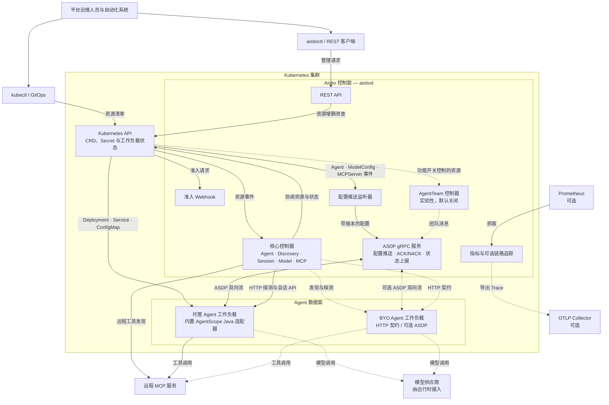

# Aistio

[English](README.md) | 简体中文

[](go.mod)
[](LICENSE)

**Istio 面向微服务，Aistio 面向 AI Agent。**

Aistio 是面向 AI Agent 工作负载的 Kubernetes 原生控制面与 Operator。
它使用 `agentscope.io/v1alpha1` 自定义资源描述 Agent、模型配置、MCP 服务、
会话和实验性团队协作。`aistiod` 将期望状态协调为 Kubernetes 工作负载，
并通过数据面 HTTP 契约和双向 Agent Service Discovery Protocol（ASDP）
连接兼容的 Agent 运行时。

当前 Helm Chart 版本为 `v0.2.0`。API 仍处于 `v1alpha1` 阶段，资源字段和行为
可能发生不兼容变更。

> [!IMPORTANT]
> Aistio 仍处于技术预览阶段，不应直接视为生产级 Agent Service Mesh。
> `AgentTeam`、`TeamTask` 和 `TeamMessage` 属于实验性能力，默认关闭。
> `SandboxClaim` 尚未实现实际沙箱供应。

## 项目边界

Aistio 提供以下控制面能力：

- 根据 `Agent` 资源创建或观测 Kubernetes 工作负载。
- 记录模型和 MCP 服务配置。
- 探测数据面健康状态并同步会话摘要。
- 通过 ASDP 推送配置并接收运行时状态上报。
- 暴露 Kubernetes API、REST API、准入 Webhook 和 `aistioctl`。

Aistio 不执行以下工作：

- 不直接调用大语言模型，也不是模型推理网关。
- 不执行 Agent 推理循环或工具调用。
- 不提供透明 sidecar 流量代理。
- 不替代 Agent 运行时；数据面必须显式实现 HTTP 契约或 ASDP。

## 能力状态

| 能力 | 当前状态 | 当前边界 |
| --- | --- | --- |
| 声明式 Agent | 可用范围受限 | 协调 ConfigMap、Deployment 和 Service；内置适配器仅支持 `agentscope-java`。 |
| BYO 工作负载 | 已实现 | 可发现或纳管现有 Deployment，并同步副本和健康状态；不会接管 `workloadRef` Deployment 的所有权。 |
| 固定副本管理 | 已实现 | 根据 Agent 规格更新 Deployment 副本数；尚未实现基于 HPA 的自动扩缩容。 |
| 数据面 HTTP 契约 | 已实现 | 支持元数据、健康状态、会话观测，以及显式压缩或终止命令。 |
| `ModelConfig` | 部分实现 | 可校验 Secret 引用并下发配置；Aistio 不代理模型请求。 |
| Remote MCP | 部分实现 | 支持 Streamable HTTP POST，并可处理 JSON 或 SSE 响应；传统 SSE transport 和 Stdio 工具发现尚未实现。 |
| ASDP | 技术预览 | 已实现双向流、配置 ACK/NACK、心跳和会话上报；部署集成仍有已知缺口。 |
| `AgentTeam` | 实验性 | 已实现任务、消息和控制面状态机；完整的多 Agent 执行闭环尚未完成。 |
| Sandbox | 未实现 | 实验控制器可以接收 `SandboxClaim`，但资源会保持 `Pending`，不会供应真实沙箱。 |

## 系统架构



Kubernetes API 保存持久化的期望状态与观测状态，Aistio 不需要额外数据库。
ASDP 连接和配置快照保存在各 `aistiod` 副本的内存中。模型请求和 MCP 工具
调用由 Agent 运行时发起，不经过控制面代理。

## API 资源

| 资源 | 用途 | 状态 |
| --- | --- | --- |
| `Agent` | 声明托管 Agent 工作负载，或描述 BYO 工作负载。 | 核心路径 |
| `AgentSession` | 跟踪运行时会话状态、Token 数量、上下文压力和显式会话命令。 | 核心路径 |
| `ModelConfig` | 校验供应商中立的模型配置，以及 Kubernetes Secret 中的凭据引用。 | 核心路径 |
| `MCPServer` | 注册 Remote 或 Stdio MCP 配置，并发现 Remote 服务中的工具。 | 核心路径，部分 transport 可用 |
| `AgentTeam` | 定义负责人、成员拓扑和团队生命周期。 | 实验性 |
| `TeamTask` | 持久化 Agent 团队中的任务归属与进度。 | 实验性 |
| `TeamMessage` | 持久化团队消息发件箱，并通过已连接的数据面交付消息。 | 实验性 |
| `SandboxClaim` | 描述 Agent 的沙箱申请。 | 实验性 API，尚未实现沙箱供应 |

## 快速开始

### 前置条件

- 可访问的 Kubernetes 集群
- Helm 3.x
- `kubectl`
- Git

本地开发还需要 Go 1.26.5 或更高版本。

### 安装控制面

克隆仓库并运行基于 Helm 的安装脚本：

```bash
git clone https://github.com/spring-ai-alibaba/aistio.git
cd aistio
./install/install.sh
```

对应的 Helm 命令如下：

```bash
helm upgrade --install aistio ./helm/aistio \
  --namespace aistio-system \
  --create-namespace
```

检查 Deployment、CRD 和版本接口：

```bash
kubectl -n aistio-system rollout status deployment/aistio-controller
kubectl get crds -o name | grep agentscope.io
kubectl -n aistio-system port-forward service/aistio-controller 8080:8080
curl http://127.0.0.1:8080/api/v1/version
```

### 创建模型配置

示例 `ModelConfig` 需要在 `production` 命名空间中存在名为
`dashscope-credentials` 的 Secret：

```bash
export DASHSCOPE_API_KEY="your-key"
kubectl create namespace production
kubectl -n production create secret generic dashscope-credentials \
  --from-literal=api-key="${DASHSCOPE_API_KEY}"
kubectl apply -f config/samples/modelconfig.yaml
kubectl -n production get modelconfig qwen-max-config
```

仓库提供以下主要资源示例：

| 示例 | 清单 |
| --- | --- |
| 远程 MCP 服务 | [`config/samples/mcpserver.yaml`](config/samples/mcpserver.yaml) |
| 声明式 Agent | [`config/samples/agent_declarative.yaml`](config/samples/agent_declarative.yaml) |
| BYO 工作负载 | [`config/samples/agent_byo_workloadref.yaml`](config/samples/agent_byo_workloadref.yaml) |
| Agent 团队 | [`config/samples/agentteam.yaml`](config/samples/agentteam.yaml) |

应用清单前，请先检查并修改内容。示例使用 `production` 命名空间、占位凭据和
环境相关端点。Agent 团队示例还需要启用实验性配置，并提前创建其中引用的
Agent 资源。

### 纳管现有工作负载

为现有 Deployment 添加 Aistio 发现标签：

```bash
kubectl label deployment my-agent agentscope.io/managed=true
```

控制面会创建对应的 BYO `Agent` 资源。数据面至少需要实现：

- `GET /agentscope/info`
- `GET /agentscope/health`

完整契约见[数据面 HTTP 契约](docs/zh/reference/data-plane-contract.md)。

### 卸载

```bash
helm uninstall aistio --namespace aistio-system
```

Helm 不会自动删除或升级 CRD。删除 CRD 前，请单独检查仍然存在的
`agentscope.io` 自定义资源和 CRD。

## 实验性功能

运行以下命令启用实验性配置：

```bash
./install/install.sh -p experimental
```

该配置会启用分布式 `AgentTeam` 协作，并暴露 ASDP gRPC Service 端口。
团队状态通过 `AgentSession`、`TeamTask` 和 `TeamMessage` 资源持久化。
该配置也会启用 `SandboxClaim` 控制器，但控制器目前只会上报“尚未实现供应”的
状态。

`aistiod` 默认启动 ASDP。当前 Helm Chart 仅在实验性配置中暴露 gRPC Service
端口，因此 Connector 启动配置仍应视为一项显式集成工作。

## 文档

- [Aistio 文档首页](docs/zh/intro.md)
- [安装指南](docs/zh/getting-started/installation.md)
- [架构](docs/zh/concepts/architecture.md)
- [核心概念](docs/zh/concepts/key-concepts.md)
- [Agent 管理](docs/zh/guides/agents.md)
- [BYO 工作负载](docs/zh/guides/byo.md)
- [模型与 MCP](docs/zh/guides/model-and-mcp.md)
- [会话管理](docs/zh/guides/sessions.md)
- [ASDP 协议](docs/zh/reference/asdp.md)
- [CLI 参考](docs/zh/reference/cli.md)
- [REST API 参考](docs/zh/reference/rest-api.md)
- [部署与运维](docs/zh/operations/deployment.md)
- [实验性团队与沙箱](docs/zh/experimental/teams-and-sandbox.md)

## 本地开发

修改 API 类型或生成的清单前，请先安装代码生成工具：

```bash
make install-tools
```

| 命令 | 用途 |
| --- | --- |
| `make build` | 构建 `bin/aistiod`。 |
| `make test` | 运行全部 Go 测试并生成 `cover.out`。 |
| `make test-integration` | 使用 `envtest` 运行控制器集成测试。 |
| `make fmt` | 格式化 Go 包。 |
| `make vet` | 运行 `go vet ./...`。 |
| `make manifests` | 重新生成 CRD、RBAC 和 Webhook 清单。 |
| `make verify` | 检查生成的 API 与部署制品是否为最新版本。 |
| `make helm-lint` | 检查 Helm Chart。 |
| `make docker-build` | 构建多架构容器镜像。 |

## 参与贡献

提交变更前请阅读 [`CONTRIBUTING_zh.md`](CONTRIBUTING_zh.md)。
安全问题报告方式和社区行为要求分别见 [`SECURITY_zh.md`](SECURITY_zh.md) 与
[`CODE_OF_CONDUCT_zh.md`](CODE_OF_CONDUCT_zh.md)。

## 许可证

Aistio 使用 [Apache License 2.0](LICENSE)。
